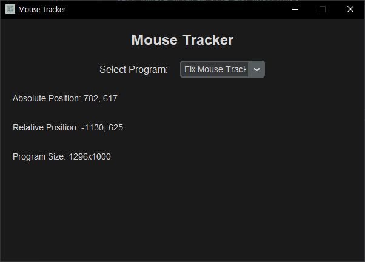

# Mouse Tracker

Mouse Tracker는 사용자의 마우스 위치를 추적하고, 선택한 프로그램 창의 상대적 위치와 크기를 표시하는 간단한 도구입니다.

## 기능

- 현재 마우스의 절대 위치를 실시간으로 표시
- 선택한 프로그램 창의 상대적 마우스 위치를 실시간으로 표시
- 선택한 프로그램 창의 크기를 표시

## 스크린샷



## 설치 방법

### 요구 사항

- Python 3.6 이상
- 다음 Python 패키지들:
  - customtkinter
  - pygetwindow
  - pyautogui
  - pywin32

### 소스 코드에서 설치

1. 리포지토리를 클론합니다:

   ```bash
   git clone https://github.com/Ryugi62/Mouse-Tracker.git
   cd mouse_tracker
   ```

2. 필요한 패키지를 설치합니다:

   ```bash
   pip install -r requirements.txt
   ```

3. 프로그램을 실행합니다:

   ```bash
   python mouse_tracker.py
   ```

## 사용법

1. 프로그램을 실행합니다.
2. "Select Program" 드롭다운 메뉴에서 추적하려는 프로그램 창을 선택합니다.
3. 현재 마우스의 절대 위치와 선택한 프로그램 창 내의 상대적 위치 및 창 크기를 확인할 수 있습니다.

## 빌드 방법

### PyInstaller로 빌드

1. PyInstaller를 설치합니다:

   ```bash
   pip install pyinstaller
   ```

2. 다음 명령어를 실행하여 단일 실행 파일을 만듭니다:

   ```bash
   pyinstaller --onefile --noconsole --icon=./icons/program_icon.ico mouse_tracker.py
   ```

3. `dist` 폴더에서 `mouse_tracker.exe` 파일을 찾을 수 있습니다.

## 기여 방법

기여를 환영합니다! 버그 신고, 기능 요청, 풀 리퀘스트 등을 통해 기여할 수 있습니다. 자세한 내용은 `CONTRIBUTING.md` 파일을 참조하세요.

## 문의

질문이나 문의사항이 있으시면 다음 이메일로 연락해주세요: [xorjf1027@naver.com](mailto:xorjf1027@naver.com)
